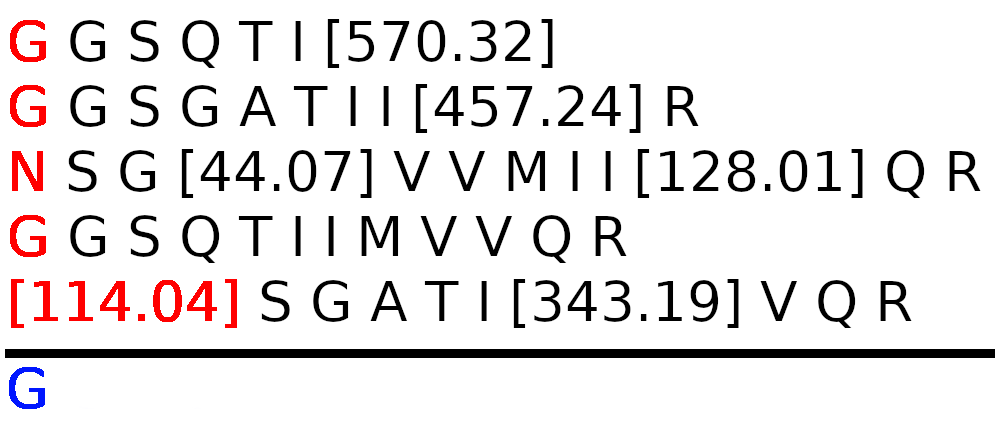

# TER-reconstructPep_py
Algorithms to reconstruct peptide sequences in Python

# Goal

Based on work carried out in the ComBi team of the LS2N (Laboratoire
des Sciences du Numérique de Nantes) and at INRAe Nantes on mass
spectrometry. We seek to solve a problem of reconstructing peptide
sequences from partial, and sometimes erroneous, data provided as
input in the form of sequences that we call _baitModels_.

_baitModels_ are sequences composed of three types of elements :
1. characters representing amino acids
2. numerical values in square brackets representing masses
3. characters in square brackets

The square brackets indicate that there has been a modification
(insertion, deletion or substitution) of one or more amino acid(s).
_baitModels_ can represent the same amino acid sequence (i.e. a peptide
that we will call _bait_) more or less. The goal of the algorithms
(i.e. `linearBaitFusion.py`, `alignBaitFusion.py`) is, on the basis of
the _baitModels_ provided, to reconstruct the peptide using (or ignoring)
the data carried by the _baitModels_.

The `alignBaitFusion.py` method uses MSA (Multiple Sequence Alignment)
algorithms (i.e. ClustalW, MUSCLE) to align the amino acids after
replacing the masses in square brackets by dashes ('-'). Then, the
_baitModels_ are "fused" using an election system per column of amino
acids.

The `linearBaitFusion.py` method uses one cursor (see illustration above)
per _baitModels_ to choose amino acids and then use an election system
to elect a candidate amino acid among the chosen amino acids.

# Parameters

The following parameters are available for both methods :
* `verbose`    : Boolean set to `False` by default. Used to activate verbose mode.
* `fulltable`  : Boolean set to `True` by default. Used to print the tables with
  details.
* `trace`      : Floating number. Used to ignore all masses within the specified
  amount (in Dalton).
* `sensitivity`: Floating number. An amount in Da used in conjunction with
  `tolerance`.
* `tolerance`  : Floating number. When looking up a mass in the mass table look
  up all entries within the specified amount (in Dalton) with a step of
  `sensitivity` Da.
* `simplification`    : Boolean set to `True` by default. Pre-processing to simplify
  _baitModels_. When a _baitModels_ has a mass that isn't found in the mass
  table then the corresponding mass, the next mass and the amino acids between
  the two masses are replaced by the sum of the masses of the aforementionned
  elements.
* `ignoreDuplicateBM` : Boolean set to `False` by default. Used to ignore
  redundant _baitModels_ when using the methods.
* `onlythisbait`      : String. Only used method on this bait.
* `minNumBaits`       : Integer. Only load baits and corresponding _baitModels_
  if there is at least the specified amount of _baitModels_.
* `maxNumBaits`       : Integer. Only load baits and corresponding _baitModels_
  if there is at most the specified amount of _baitModels_.

The method `linearBaitFusion.py` have the following additional parameters :
* `valid`, `probation`, `invalid` : Integers [4, 1, 0 by default]. Weights
that are used when electing a candidate (an amino acid coming from a valid
_baitModel_ should have more votes than an amino acid from a probation _baitModel_)
* `secondpass` : Boolean set to `True` by default. If the `linearBaitFusion.py`
method fails to provide a complete sequence by iterating through the _baitModels_
from left to right, it will try to generate a sequence by iterating through the
_baitModels_ from right to left.
* `concatenation` : Boolean set to `True` by default. If `secondpass` is set
to `True` and the pass from right to left fails to provide a complete sequence
then the method will concatenate both incomplete sequences (the one obtained
from left to right and the one obtained from right to left). If the mass of
the resulting sequence is greater than the average mass of the _baitModels_ by
a certain margin then amino acids from the sequence right-to-left are deleted
until the mass of the concatenated sequence is equal to the average mass of the
_baitModels_.
* `simplifyBothWays` : Boolean set to `True` by default. If `simplification` is
set to `True`, the simplified _baitModels_ are used in the second pass of the
method too.
* `replaceDashByMass` : Boolean set to `True` by default. Post-processing to
replace the gaps of incomplete sequences by amino acids if the gaps correspond
to the mass of amino acids, by a sequence of amino acids in curly brackets if
the gaps correspond to the mass of a single sequence of amino acids, or by the
mass of the gaps otherwise.

The method `alignBaitFusion.py` have the following additinal parameters :
* `useMuscle`  : Boolean set to `False` by default. Use MUSCLE instead of
  ClustalW (the default is ClustalW).
* `clustalopt` : String. Options to provide to ClustalW ("-QUICKTREE -MATRIX=ID
-GAPOPEN=5 -GAPEXT=1 -NOHGAP -NOWEIGHTS -CLUSTERING=UPGMA" by default)
* `muscleopt`  : String. Options to provide to MUSCLE (Empty by default).

# Outputs

The methods output four plots and a csv file containing all baits with the
output sequences of the method, the length of the baits, the longest stretch
between the baits and the output sequences and the number of amino acids that
are not covered by the longest stretch.
